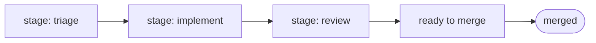

<p align="center">
  <a href="https://tryteam1.com/?utm_source=github&amp;utm_medium=referral&amp;utm_campaign=factory_readme&amp;utm_content=banner"></a>
</p>

<p align="center">
  <a href="https://tryteam1.com/?utm_source=github&amp;utm_medium=referral&amp;utm_campaign=factory_readme&amp;utm_content=link_row"><strong>Website</strong></a>
  ·
  <a href="https://github.com/Team1-dev/Team1-demo">Demo</a>
  ·
  <a href="https://discord.gg/4S6MSBW48A">Discord</a>
  ·
  <a href="https://github.com/Team1-dev/Team1-Factory/discussions">Discussions</a>
  ·
  <a href="#setup">Quick start</a>
</p>

<p align="center">
  <a href="LICENSE"></a>
  <a href="https://github.com/Team1-dev/Team1-Factory/releases/latest"></a>
  <a href="#requirements"></a>
</p>

# Team1 Software Factory

**Turn GitHub issues into shipped software.**

Team1 is an open-source, self-hosted software factory for GitHub. Label an issue and Claude Code takes it through triage, plan, implementation, tests and review, then opens the pull request. It runs on your own server with your own Claude subscription, and nothing merges unless your test commands pass.



**Team1 builds itself:** every [merged pull request](https://github.com/Team1-dev/Team1-Factory/pulls?q=is%3Apr+is%3Amerged) in this repo started as an issue Team1 triaged.<br>
Watch one go from [issue](https://github.com/Team1-dev/Team1-demo/issues/24) to [merged PR](https://github.com/Team1-dev/Team1-demo/pull/30) on the [demo app](https://github.com/Team1-dev/Team1-demo).

---

<br>

> [!CAUTION]
> ## ⚠️ WARNING — run Team1 on an isolated machine
>
> **Do not run Team1 on your personal computer.** Use a disposable VPS, VM, container, or other isolated environment.
>
> Team1 runs Claude Code with permission checks disabled and executes commands from managed repositories. It also has access to GitHub and Claude Code credentials.
>
> * Use a dedicated VPS, VM, or container.
> * Use a dedicated GitHub account with access only to required repositories.
> * Do not store personal credentials, SSH keys, cloud credentials, or other secrets on the host.
> * Assume code in a managed repository can execute with Team1's permissions.
> * Prefer testing with a private repository; public repositories are not tested.

## Requirements

* A fresh Linux VPS. The steps below are for Ubuntu or Debian.
* Node.js 22.18+
* `git`, `jq`, `npm`
* `pnpm` if required by a repository
* Claude Code, installed and logged in
* Dedicated GitHub account

Team1 must run as an ordinary user, not root. Claude Code refuses to run unattended as root, so the implement and review stages would fail. Claude Code must be logged in as that same user, with `~/.claude/.credentials.json` present.

## Setup

### 1. As root: system packages, Node and a user

Log in to the VPS as root. A provider web console works; no SSH client is needed.

```sh
apt-get update && apt-get install -y git jq curl
curl -fsSL https://deb.nodesource.com/setup_22.x | bash -
apt-get install -y nodejs
adduser --disabled-password --gecos "" team1
su - team1
```

Everything from here on runs as `team1`. Each time you open a new console session, run `su - team1` first.

### 2. As team1: install Claude Code and log in

```sh
curl -fsSL https://claude.ai/install.sh | bash
echo 'export PATH="$HOME/.local/bin:$PATH"' >> ~/.bashrc
source ~/.bashrc
claude
```

Claude Code prints a login URL. Open it in a browser on any machine, then paste the code it gives you back into the terminal. Once logged in, exit Claude Code.

### 3. Configure GitHub

Create a dedicated GitHub account and give it access to the repositories Team1 manages.

Create a token with:

* Contents — read/write
* Issues — read/write
* Pull requests — read/write
* Commit statuses — read/write
* Metadata — read

A classic token with `repo` scope also works.

Keep the token on the Team1 host only.

### 4. Install Team1

```sh
git clone https://github.com/Team1-dev/Team1-Factory.git team1
cd team1
npm ci
```

### 5. Configure Team1

Create `.env`:

```sh
REPOS=owner/repo,owner/other-repo
GITHUB_TOKEN=github_pat_...

# Optional
TRUSTED_LOGINS=alice,bob
WORK_DIR=/srv/team1/work
# A token for one repository: GITHUB_TOKEN_ + owner/name, with characters outside [0-9a-z] replaced by _
GITHUB_TOKEN_owner_other_repo=github_pat_...
```

Web consoles often mangle pasted text. After pasting the token, check it with `cat .env`.

Credentials are not passed to Claude Code or gate commands.

Operational settings such as polling, retries, concurrency, and cost limits are environment variables; their names and defaults are at the top of `src/config.mjs`.

## Configure repositories

Each repository needs:

```text
.agents/project.md
```

This defines project rules and the commands that must pass.

Example:

```markdown
gates: npm run lint && npm test
gates-full: npm run test:all
human-approvals: 1
auto-merge: true

# My project

What this project is and who uses it.

## House style

Project-specific conventions.

## Invariants

Things that must never be violated.
```

Settings. All are optional:

| Setting           | Purpose                                    | When absent                                              |
| ----------------- | ------------------------------------------ | -------------------------------------------------------- |
| `gates`           | Commands required before pushing           | `npm run lint --if-present && npm run build --if-present` |
| `gates-full`      | Comprehensive gates for structural work    | `gates` is used                                          |
| `human-approvals` | Required approvals before merging          | `0`                                                      |
| `auto-merge`      | Allow Team1 to merge reviewed, passing PRs | `false` — a person merges                                |
| `review-ignore`   | Files excluded from review                 | only generated files are excluded                        |
| `uses`            | Projects whose gates should also run       | none. Monorepos only                                     |
| `projects`        | Projects within a monorepo                 | one project. Monorepos only, root file only              |

Use `.agents/style.md` for detailed coding conventions.

Put security-sensitive boundaries in **Invariants**, such as authentication, data deletion, migrations, public APIs, payments, and destructive infrastructure changes.

## Monorepos

Define projects in the root `.agents/project.md`:

```markdown
projects:
  api: packages/api
  web: packages/web
  shared: packages/shared
```

Each project can have its own `.agents/project.md` and `.agents/style.md` at its path; their settings override the root's. Use `project: <name>` labels to target a project, or `project: all` for repository-wide work.

## Run Team1

Test one pass first. This also creates Team1's labels in each repository:

```sh
npm run tick
```

Then start the factory:

```sh
npm start
```

Watch logs with:

```sh
npm run logs
```

Check whether it is running with:

```sh
npm run status
```

Stop gracefully with:

```sh
npm stop
```

Team1 finishes the current card before stopping. Run `npm stop` again to abort it. `touch STOP` in the Team1 directory does the same as `npm stop`.

Team1 keeps running after you close the console. It does not restart automatically after a reboot; log in, `su - team1`, and run `npm start` again.

## Give Team1 work

GitHub issues are the interface.

Create an issue describing the desired outcome and add:

```text
stage: triage
```

Team1 then moves it from label to label, as in the diagram at the top, until it is merged.

Issues without `stage: triage` are ignored.

### Useful labels

| Label              | Meaning                                                  |
| ------------------ | -------------------------------------------------------- |
| `stage: triage`    | Issue is being assessed                                  |
| `stage: implement` | Implementation is underway                               |
| `stage: review`    | Change is under review                                   |
| `ready to merge`   | Passed review and gates                                  |
| `needs: answers`   | Waiting for a human. Reply on the issue to restart it    |
| `human-review`     | Blocks automatic merging                                 |
| `parked`           | Unsafe or irreversible as specified                      |
| `failed`           | Team1 could not complete the work                        |
| `attack`           | Hostile or hidden instructions detected                  |
| `duplicate`        | Already covered elsewhere. Close it, or re-add `stage: triage` |
| `findings`         | Finding recorded but intentionally not fixed             |

Priority labels (`high`, `medium`, `low`) control scheduling.

## Dependencies

Block an issue with:

```text
blocked-by: #50
```

Team1 waits for the referenced issue to complete.

## Trusted instructions

By default, Team1 treats issues and comments from repository write-access users as instructions.

Additional accounts can be trusted with:

```sh
TRUSTED_LOGINS=alice,bob
```

Content from other users is treated as information, not executable instructions.

## Cost and observability

Team1 records model activity, verdicts, and costs on issues and in:

```text
WORK_DIR/metrics.jsonl
```

Per-card cost limits and operational settings help prevent runaway work.
